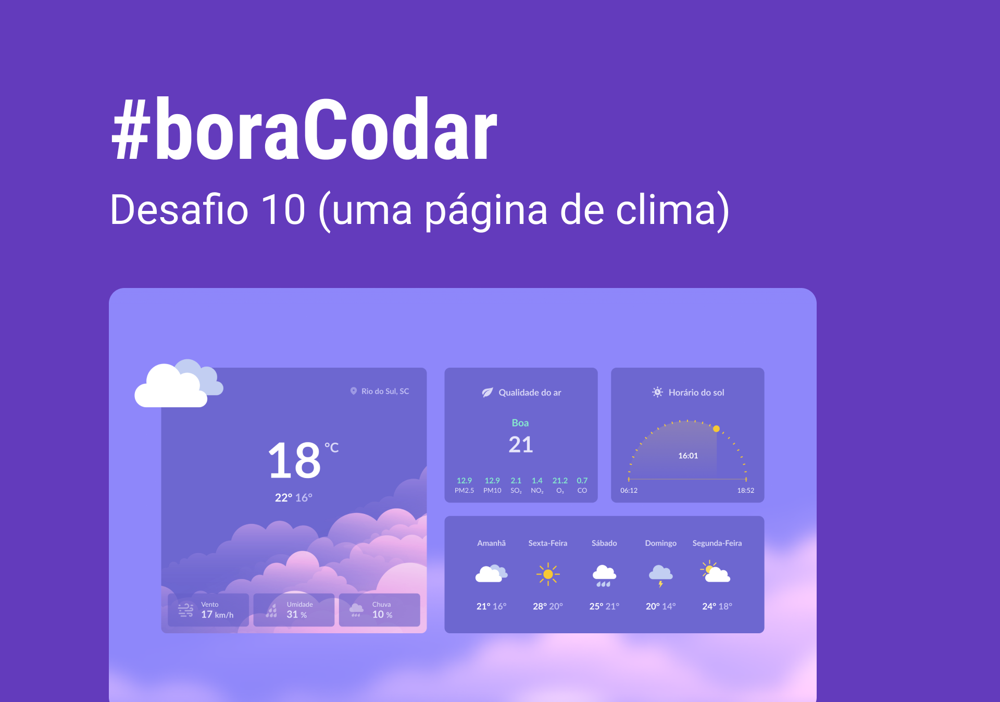

<h1 align="center"> Cartão de embarque </h1>

<p align="center">
#boraCodar são desafios semanais, promovido pela Rocketseat para ensino de tecnologias WEB. <br/>
</p>

<p align="center">
  <a href="#-tecnologias">Tecnologias</a>&nbsp;&nbsp;&nbsp;|&nbsp;&nbsp;&nbsp;
  <a href="#-layout">Layout</a>&nbsp;&nbsp;&nbsp;|&nbsp;&nbsp;&nbsp;
  <a href="#memo-licença">Licença</a>
</p>

<p align="center">
  
</p>

<br>

<p align="center">
  
</p>

## 🚀 Tecnologias

Esse projeto foi desenvolvido com as seguintes tecnologias:

- HTML e CSS
- Git e Github
- Figma
- https://apexcharts.com

## 🔖 Layout

Você pode visualizar o layout do projeto através [DESSE LINK](https://www.figma.com/file/ZSOOq1fgQydDhXdb7ryYql/%23boraCodar---Desafio-9-(Community)?node-id=1-5&t=deo0PRQQsL7uuixH-0). É necessário ter conta no [Figma](https://figma.com) para acessá-lo.

## 📚 O que aprendemos nesse desafio

```md
# CSS

- aplicar variável pelo atributo HTML
- fit-content
- place-content /  / justify-content
- centralizar div com position/grid/flex/margin
- ::before / ::after
- responsividade / mobile first / @media
```

## :memo: Licença

Esse projeto está sob a licença MIT.

---

Feito com ♥ by Rocketseat :wave: [Participe da nossa comunidade!](https://discord.gg/rocketseat)
